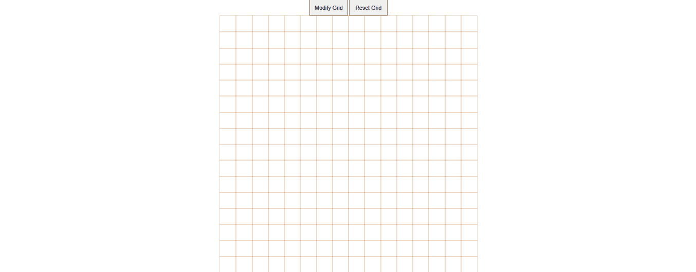

# Etch-A-Sketch

## Live Link
https://obsidiansonnet.github.io/etch-a-sketch/

## A Gif Screen Shot
 

## Description
A browser-based tool that is somewhere between a sketchpad and an Etch-A-Sketch toy. Built with HTML, CSS, and plain JavaScript. Part of The Odin Project curriculum.  

## Features
- A pre-set grid of 16 X 16, which is customizable dynamically through the Modify Grid button. Dimensions range from 1 square to 50 X 50 squares.   
- Hover states to fill color. Filled colors remain visible until the grid is cleared using the Reset Grid button. 
- Reset Grid button to remove colors but retain the grid with the initially selected dimensions.

## Tech Stack
HTML5, CSS3, Flexbox, Vanilla JavaScript.  

## Engineering Decisions

- **Grid Generation:** Initially attempted to handle initial grid creation and user-triggered grid modification within a single function. This resulted in circular logic and duplicate grids stacking in the DOM.
    - **Refactor to Single Responsibility:** Split the architecture into three distinct, single-purpose functions:
    1. `createGrid(n)`: Handles only the mathematical generation and insertion of the squares in the DOM.
    2. `removeStaticGrid()`: Clears the parent container using `textContent = ""`.
    3. `gridPromptOnClick()`: Handles user input and validation.
    - **Result:** A modular, predictable event flow where the 'Modify Grid' listener orchestrates the tear-down and rebuild process sequentially.

- **Color-filling, opacity modification, and resetting the grid to remove colors:** Drawing on the lessons learned while creating the grid management functions, I created single-purpose functions as follows:
    1. `colorCodeGenerator()`: Generates a string value for the `backgroundColor` property for the grid-squares.
    2. `colorFiller(color, event)`: Uses the string value generated by `colorCodeGenerator()` to apply the `backgroundColor` property to the event-target squares.
    3. `opacityModifier(event)`: Handles only opacity modification for the event-target squares. Repeated mouseover events increase opacity by 10% on every single instance until the opacity value reaches 1.  
    - **Result:** An intuitive management of mouseover events and maintainable, human-readable code. Makes the functions potent for re-purpose & re-use with minimal modifications and enhancements without breaking anything else. 

- **Event delegation for handling mouseover events:** Used event delegation instead of setting up listeners for individual squares to optimize for processing load.  

## Challenges & Key Learnings

**Grid Generation**
- **The Circular Logic Trap:** Initially, I visualized one function that would handle all grid tasks (default creation, custom creation, and deletion). Implementing this revealed a circular logic trap that caused grids to stack. *Resolution:* I broke this down into single-responsibility functions, utilizing a state variable to hand off the validated user input to the generation function. 

- **The State Preservation Challenge (Grid Reset):** Initially, I thought of resetting the grid by removing colors from the squares, undoing the work done by the color-fill functions. However, it proved difficult because `textContent = ""` does not remove inline CSS styles.  *Resolution:* Changed the perspective. Instead of removing colors, I decided to regenerate the grid as per the user's initially chosen dimensions from scratch. To this effect, I elevated the dimension variable `n` to the global scope, allowing the reset button to easily clear the board and pass `n` back into `createGrid()` to regenerate the exact same board from scratch.    

**Color-Filling & Opacity Modification**
- **The Ghost Event:** Initially, my mouseover functions relied on an implicit `event.target` without passing `event` as an argument. The code worked due to a JavaScript quirk in which the engine searches the global scope for the event. *Resolution:* Once I understood this was a fatal architectural flaw, I explicitly passed the `event` object as an argument to the applicable functions.

- **CSS Class State Management:** Ensuring the random color only applied on the first mouseover required careful state management. *Resolution:* Instead of removing the core structural class (which would destroy the formatting), I added a specific `.colored` class on the first pass and conditioned the listener to ignore squares that already had it.

**Key Learnings**
- Separation of concerns may seem relative—for example, it might seem that everything related to grid management can be handled by one function—but it should most likely be thought of as absolute. At the planning stage itself, if one function seems to be doing a lot of things, it is indeed doing more than it should. We must try to make functions that do just one thing and to see that they do that one thing very well.

- JavaScript is a very forgiving language, making it very susceptible to quirks and flaws that wouldn't affect the implementation objectively but can present themselves as fatal flaws in certain situations. So, regardless of its forgiving nature, one must be very careful in drafting code to ensure that it works as desired and not accidentally.

## Future Improvements
- Add a color-picker tool to allow users to work with colors of their choice.

- Add an eraser that allows the user to remove only a certain part of their drawing.

- Add some aesthetic design to the interface to make the user experience more enjoyable. 

- Add a feature that allows the user to save their work, and perhaps merge their works so that they can think of their designs modularly or use this tool to draw only parts of their work which come together to make a complete piece.